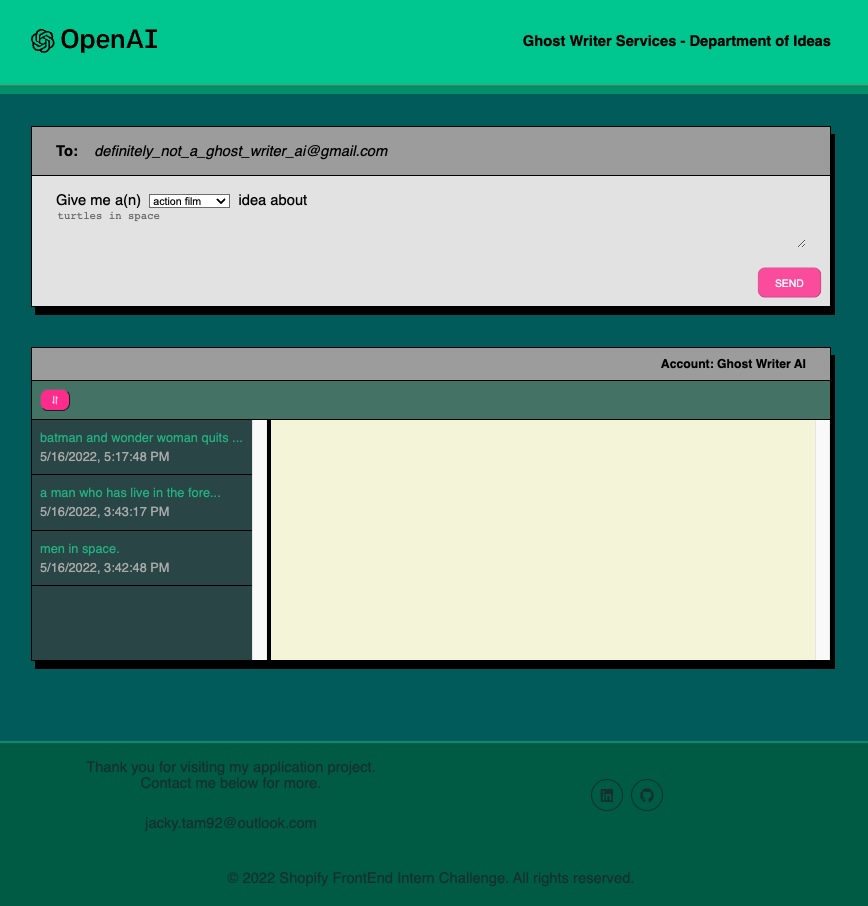
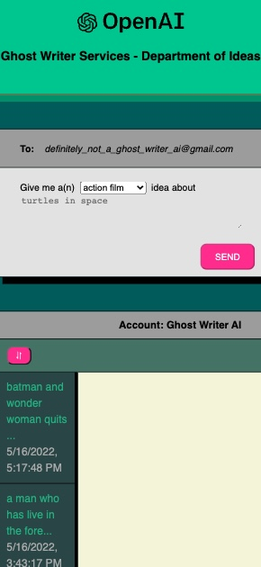

# Huddle - single page responsive styling using styled-components

## General Information
This is a [project](https://ai-movie-ghost-writer.netlify.app/) submission for the "Shopify Technical Challenge". The objective of the project is to use GPT-3 (an AI model created by OpenAI) to process user input in a way to showcase the project creator's creativity and decision making process. As a user, you are allowed to choose a movie genre and type in a topic. The data is submitted to the AI and a response is displayed in an email format. The theme of this project revolves around the user using an AI as a ghost writer for movie ideas.

   

## Technologies used
* React, styled components
* HTML & CSS
* Git v2.33.1 Mac
* Visual Studio Code v1.62.3

## Features
### Implemented
* Use of Open AI for input and output relating to movie ideas
* Localized styling with single Global style with theme provider
* Local storage used to persist user input and AI output even upon refresh
* Sort button can be used to display data in terms of recency

### Future Development Ideas
* Increase responsive range of devices
* Use animations to print AI response in email window
* Provide more cases for input and allowing users to directly calibrate AI variables

